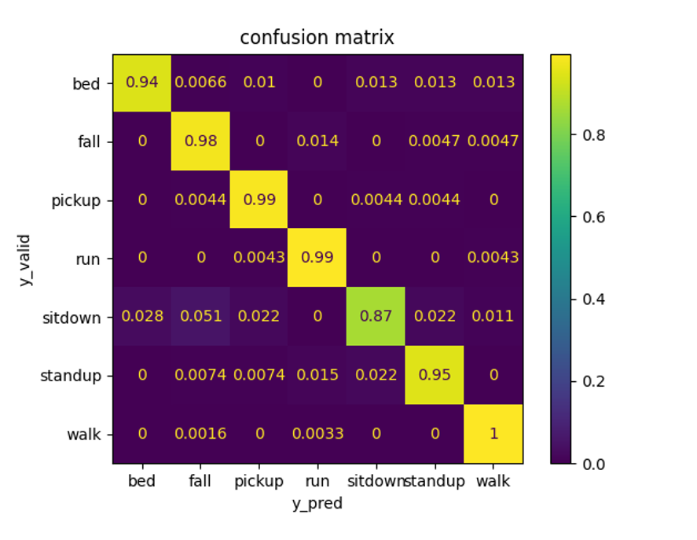

# Wi-Fi CSI Human Activity Recognition Model

This project implements a human activity recognition (HAR) model using Wi-Fi Channel State Information (CSI) signals. CSI data, obtained from Wi-Fi devices, provides fine-grained information about the wireless channel, including signal amplitude, phase, and frequency. Leveraging this rich data source, our model accurately classifies human activities in a given environment.

## Key Features:
- **CSI Signal Processing:** Preprocessing involves filtering the CSI data using a Butterworth filter to enhance signal quality and remove noise.
- **Deep Learning Architecture:** The model architecture incorporates Bidirectional Long Short-Term Memory (BiLSTM) networks, known for their ability to capture temporal dependencies in sequential data, making them ideal for HAR tasks. The BiLSTM layers consist of 200 units each.
- **Attention Mechanism:** An attention mechanism with 400 hidden units is employed to focus on relevant parts of the input sequence during model training.
- **Real-time Inference:** Efficient algorithms for real-time inference on streaming CSI data enable quick and accurate activity recognition.
- **Confusion Matrix for Accuracy:** Model accuracy can be obtained using the provided confusion matrix, allowing users to assess the performance across different activity classes.
- **Optimizer and Learning Rate:** The model is trained using RMSprop optimizer with a learning rate of 1e-4.
- **Training Epochs:** The model is trained for 50 epochs to ensure convergence and optimal performance.
- **Robustness:** Designed to handle variations in Wi-Fi environment and user movements.
## Confusion Matrix:

## How to Use:
1. **Data Collection:** Gather Wi-Fi CSI data using compatible hardware and software tools.
2. **Data Preprocessing:** Apply a Butterworth filter to clean and enhance the collected CSI data before feeding it into the model.
3. **Model Training:** Utilize the provided scripts to train the HAR model, employing BiLSTM networks with attention mechanisms and specified parameters.
4. **Evaluation:** Evaluate model performance using standard metrics, including the confusion matrix, and test datasets to ensure accuracy and robustness.
5. **Deployment:** Integrate the trained model into your application for real-world activity recognition tasks.

## Requirements:
- Python 
- TensorFlow 
- NumPy, Pandas, Scikit-learn

